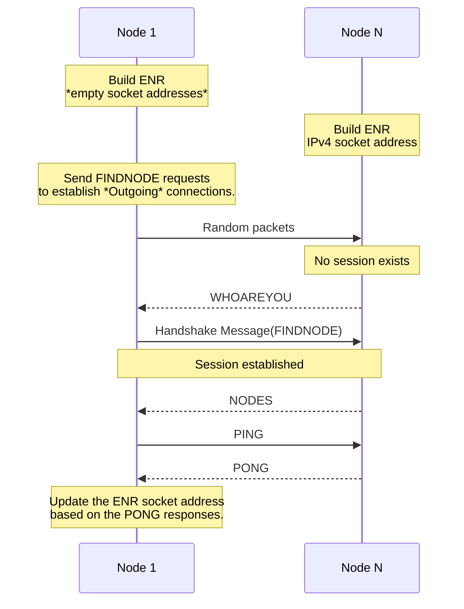

# Testground test plans for discv5

[](https://github.com/ackintosh/discv5-testground/actions/workflows/ci.yml)

This repository contains [Testground](https://github.com/testground/testground) test plans for [discv5](https://github.com/sigp/discv5).

## Getting started

```shell
# Import the test plan
git clone https://github.com/ackintosh/discv5-testground.git
testground plan import --from ./discv5-testground

# Run the test plan
testground run single \
  --plan=discv5-testground \
  --testcase=find-node \
  --builder=docker:generic \
  --runner=local:docker \
  --instances=5 \
  --wait
```

## Test cases

- [find-node](#find-node)
- [eclipse-attack-monopolizing-by-incoming-nodes](#eclipse-attack-monopolizing-by-incoming-nodes)
- [enr-update](#enr-update)
- [ip-change](#ip-change)
- [concurrent-requests](#concurrent-requests)
- [concurrent-requests_whoareyou-timeout](#concurrent-requests_whoareyou-timeout)
- [concurrent-requests_before-establishing-session](#concurrent-requests_before-establishing-session)
- [talk](#talk)
- [sandbox](#sandbox)

### [`find-node`](#test-cases)

In this test case, the participants construct a star topology which bootstrap node at the center, and then run the FINDNODE query. Each node run the query to test whether the node can discover all other nodes in the test case.

```shell
testground run single \
  --plan=discv5-testground \
  --testcase=find-node \
  --builder=docker:generic \
  --runner=local:docker \
  --instances=5 \
  --wait
```

#### Star topology

Initially, the bootstrap node's routing table contains all the nodes' ENR in the test, and each node's routing table contains the bootstrap node's ENR only.


### [`eclipse-attack-monopolizing-by-incoming-nodes`](#test-cases)

In this test case, the attacker crafts a node id which will be inserted into the particular bucket in the victim's routing table. And then the attacker sends a query to the victim in order to let the victim add the attacker's node id to its routing table (particular bucket).

The victim's routing table will be filled with the attacker's "incoming" entries if the victim is vulnerable to the attack.

```shell
testground run composition \
  -f compositions/eclipse-attack-monopolizing-by-incoming-nodes.toml \
  --wait
```

The test case should result in success. The attackers fail to fill the victim's routing table with their node id because we limit the number of incoming nodes per bucket. See: [`eclipse-attack-monopolizing-by-incoming-nodes.toml`](https://github.com/ackintosh/discv5-testground/tree/main/compositions/eclipse-attack-monopolizing-by-incoming-nodes.toml).

If you comment out this parameter as follows and run again, the victim node emits "Table full" error and the test case results in failure, since the victim's routing bucket is full of the "incoming" attacker node ids.

```diff
    [groups.run.test_params]
-    incoming_bucket_limit = "8"
+    # incoming_bucket_limit = "8"
```

### [`enr-update`](#test-cases)

```shell
testground run single \
  --plan=discv5-testground \
  --testcase=enr-update \
  --builder=docker:generic \
  --runner=local:docker \
  --instances=11 \
  --wait \
  | grep 'The socket has been updated'
```



### [`ip-change`](#test-cases)

In this test plan, we would simulate the scenario where the external IP address of a node changes.

This plan runs some discv5 nodes and then one of these node changes its IP address. Note that the node doesn't change the IP address in the ENR at that time.

```shell
testground run single \
  --plan=discv5-testground \
  --testcase=ip-change \
  --builder=docker:generic \
  --runner=local:docker \
  --instances=3 \
  --wait
```

Note: currently `ping_interval` is set to 1sec as default for ease of testing. See manifest.toml.


### [`concurrent-requests`](#test-cases)

```shell
testground run single \
  --plan=discv5-testground \
  --testcase=concurrent-requests \
  --builder=docker:generic \
  --runner=local:docker \
  --instances=2 \
  --wait
```



```mermaid
sequenceDiagram
    participant Node1
    participant Node2
    Note over Node1: Start discv5 server
    Note over Node2: Start discv5 server

    rect rgb(10, 10, 10)
    Note left of Node1: They communicate with each other<br> to establish a session.
    Node1 ->> Node2: message
    Node2 ->> Node1: message
    Note over Node1,Node2: Session established
    end

    rect rgb(100, 100, 0)
    Note right of Node2: In this test case, Node2 session timeout <br>is set to short term (a few seconds)<br> to reproduce session expiration.
    Note over Node2: Session expired
    end

    rect rgb(10, 10, 10)
    Note left of Node1: Node1 sends multiple requests<br> **in parallel**.
    par 
    Node1 ->> Node2: FINDNODE
    and 
    Node1 ->> Node2: FINDNODE
    end
    end
```

### [`concurrent-requests_whoareyou-timeout`](#test-cases)

A test case where WHOAREYOU packet times out.

```shell
testground run single \
  --plan=discv5-testground \
  --testcase=concurrent-requests_whoareyou-timeout \
  --builder=docker:generic \
  --runner=local:docker \
  --instances=2 \
  --wait
```



```mermaid
sequenceDiagram
    participant Node1
    participant Node2

    Node2 ->> Node1: Random packet
    Node1 ->> Node2: WHOAREYOU
    rect rgb(100, 100, 0)
    Note over Node2: ** Discard the WHOAREYOU packet<br>to reproduce kind of network issue. **
    end

    rect rgb(10, 10, 10)
    Note left of Node1: Node1 want to send FINDNODE to Node2<br>but active_challenge exists.<br>So insert requests into pending_requests.
    par 
    Note over Node1: pending_requests.insert()
    and 
    Note over Node1: pending_requests.insert()
    end
    end

    rect rgb(100, 100, 0)
    Note over Node1: The challenge in active_challenges<br>has been expired.
    end
```

### [`concurrent-requests_before-establishing-session`](#test-cases)

A test case where a node attempts to send requests in parallel before establishing a session.

```shell
testground run single \
  --plan=discv5-testground \
  --testcase=concurrent-requests_before-establishing-session \
  --builder=docker:generic \
  --runner=local:docker \
  --instances=2 \
  --wait
```



```mermaid
sequenceDiagram
    participant Node1
    participant Node2

    Note over Node1: No session with Node2

    rect rgb(10, 10, 10)
    Note left of Node1: Node1 attempts to send multiple requests in parallel <br> but no session with Node2.<br> So Node1 sends a random packet for the first request, <br>and the rest of the requests are inserted into pending_requests.
    par
    Node1 ->> Node2: Random packet (id:1)
    Note over Node1: Insert the request into `active_requests`
    and
    Note over Node1: Insert Request(id:2) into *pending_requests*
    and
    Note over Node1: Insert Request(id:3) into *pending_requests*
    end
    end

    Node2 ->> Node1: WHOAREYOU (id:1)

    Note over Node1: New session established with Node2

    rect rgb(0, 100, 0)
    Note over Node1: Send pending requests since a session has been established.
    Node1 ->> Node2: Request (id:2)
    Node1 ->> Node2: Request (id:3)
    end

    Node1 ->> Node2: Handshake message (id:1)

    Note over Node2: New session established with Node1

    Node2 ->> Node1: Response (id:2)
    Node2 ->> Node1: Response (id:3)
    Node2 ->> Node1: Response (id:1)

    Note over Node1: The request (id:2) completed.
    Note over Node1: The request (id:3) completed.
    Note over Node1: The request (id:1) completed.
```

### [`talk`](#test-cases)

This test plan runs simple TALKREQ/TALKRESP communication between two nodes.

```shell
testground run single \
  --plan=discv5-testground \
  --testcase=talk \
  --builder=docker:generic \
  --runner=local:docker \
  --instances=2 \
  --wait
```

### [`sandbox`](#test-cases)

This is a special test plan where the test flow is undefined, used for experiments to debug.

```shell
testground run single \
  --plan=discv5-testground \
  --testcase=sandbox \
  --builder=docker:generic \
  --runner=local:docker \
  --instances=2 \
  --wait
```

## Metrics

Metrics are stored into the metrics store, InfluxDB. The metrics can be visualized with Grafana, bundled with Testground. 

Open Grafana (localhost:3000) and run the following query.

```sql
select
  *
from
  "discv5-testground_find-node_{run_id}"
group by
  instance_seq
```
